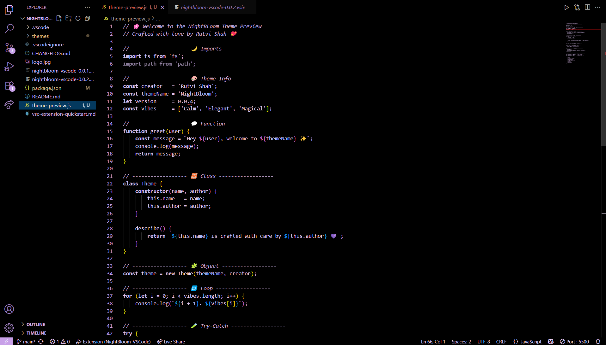

# 🌸 NightBloom — A VS Code Theme by Rutvi

> "When the world sleeps and your mind comes alive, NightBloom is your quiet little garden of code — soft, deep, and soothing."

---

## 🌙 About the Theme

**NightBloom** isn't just a theme.  
It's your companion during the quiet hours. A soft whisper in the silence.  
Made for dreamers, thinkers, and coders who find beauty in stillness.  
With gentle purples and deep blacks, it brings focus without harshness and beauty without noise.

**✨ Enhanced for Better Readability**  
Now featuring lighter purple colors for improved contrast and easier reading while maintaining the peaceful purple aesthetic.

---

## ✨ Why Choose NightBloom?

- 🎨 **Elegant Syntax Highlighting** — calm colors with enhanced readability  
- 🌑 **Dark Background** — built for late-night clarity and comfort  
- 🧠 **Focus-Friendly** — no distractions, no eye strain  
- 🖤 **Themed Debug + Status Bars** — full immersive experience  
- 💖 **Crafted with Love** — by Rutvi, for creators like you  
- 👁️ **Better Contrast** — lighter purples for easier reading

---

## 🌸 How to Install

1. Open **Visual Studio Code**
2. Go to the **Extensions** panel (`Ctrl + Shift + X`)
3. Search for **NightBloom**
4. Click **Install**
5. Open the **Command Palette** (`Ctrl + Shift + P`)
6. Choose `Color Theme` → Select **NightBloom by Rutvi**

---

## 🌃 Perfect For:

- Midnight sessions with your favorite playlist  
- Journaling in comments and writing expressive code  
- Finding peace while working in silence  
- Turning your editor into your personal comfort space 💻🕯️  
- Long coding sessions with reduced eye strain

---

## 🫶 From Rutvi, With Love

Hi there 👋🏻  
I'm Rutvi — a passionate developer who believes your editor should feel like home.  
**NightBloom** was born from those late-night moments when code felt like poetry and silence felt like music.  
I hope this theme brings you a little peace, a little magic, and a lot of beautiful code.

---

## 📬 Feedback & Love

If you enjoy NightBloom, please share your thoughts, leave a review, or just say hi 🥰  
Let's grow this night garden together 🌸🌙

> _Let your code bloom in stillness — with NightBloom by Rutvi_

---

## 🖼️ Theme Preview

A little glimpse into the NightBloom vibe — cozy code, soft glow, and peaceful colors ✨

---
